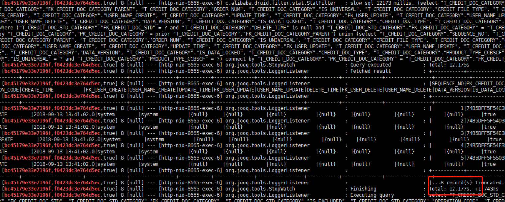
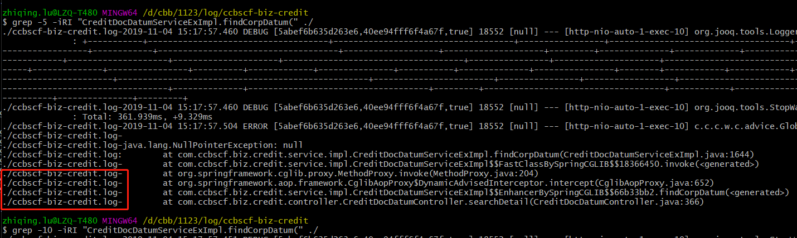
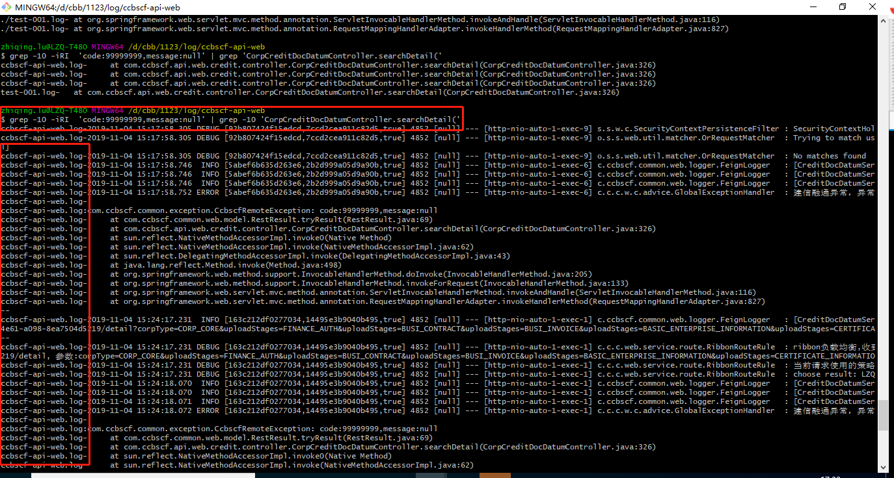
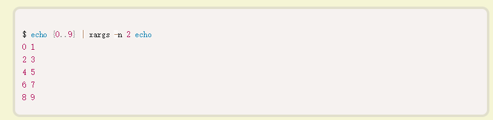
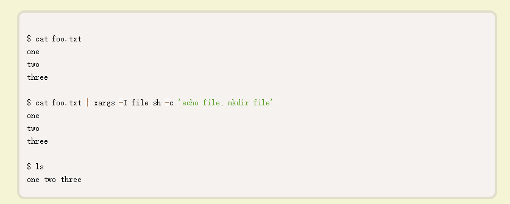

# 慢sql
* Durid数据源会打印慢sql,可以直接根据```less slow sql```
> 
# grep命令
* 查一个文件夹下所有的日志```grep -iRI "你想查的内容" ./``` 
> 并且会把对应的某个文件也打出来
> 
* 可以指定关键字前后的范围
> 1. ```grep -A 5```打印匹配行的后5行
> 2. ```grep -B 5```打印匹配行的前5行
> 3. ```grep -C 5```打印匹配行的前后5行
> 4. ```grep -5  ```打印匹配行的前后5行
* 使用grep嵌套可以做到匹配日志块的目的
``` grep -10 -iRI  'code:99999999,message:null' | grep -10 'CorpCreditDocDatumController.searchDetail('```
> 
* xargs命令
1. 作用是将换行等转为空格：使用```echo "one two three" | xargs mkdir = mkdir one two three```
2. 混合使用```find . -name 'ccbscf-api-web*10-18*'|xargs zgrep 'credit'```
3. -d指定分隔符，默认空格
4. -p参数打印出要执行的命令，询问用户是否要执行
5. -t参数则是打印出最终要执行的命令，然后直接执行
6. -O表示以null为分隔符，与find的-printO9(找到的文件以null作为分隔符)参数对应```find /path -type f -print0 | xargs -0 rm```
7. -L参数指定多少行作为一个命令行参数
> ```echo -e "a\nb\nc" | xargs -L 1 echo``` 该代码指定每行运行一次echo命令，所以echo命令执行了三次
8. -n参数指定每次将多少项，作为命令行参数
> ```echo {0..9} | xargs -n 2 echo```这个命令指定，每两个参数运行一次echo命令。所以，10个阿拉伯数字运行了五次echo命令
> 
9. -I将命令行参数传给多个命令
>  
> 
> 上面代码中，foo.txt是一个三行的文本文件。我们希望对每一项命令行参数，执行两个命令（echo和mkdir），使用-I file表示file是命令行参数的替代字符串。执行命令时，具体的参数会替代掉echo file; mkdir file里面的两个file
10. --max-procs 启用多进程
> xargs默认只用一个进程执行命令。如果命令要执行多次，必须等上一次执行完，才能执行下一次。--max-procs参数指定同时用多少个进程并行执行命令
* sz命令下载文件
